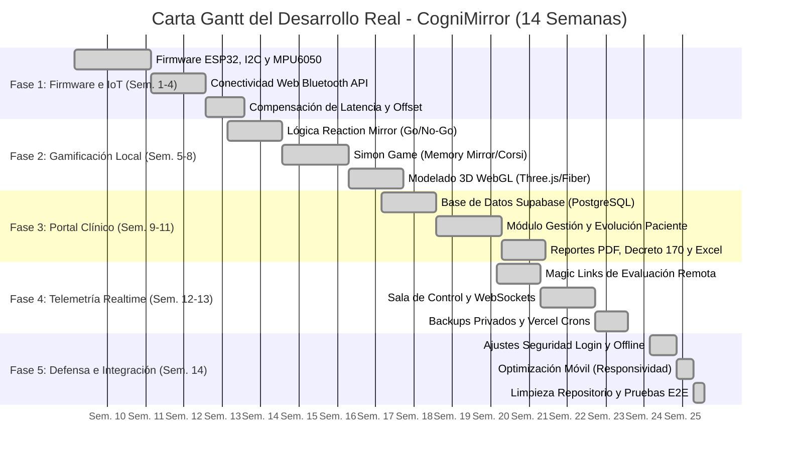

# 📅 Planificación Temporal Real del Proyecto (Carta Gantt) - CogniMirror

Este documento detalla la planificación temporal e hitos de desarrollo reales llevados a cabo para la construcción de **CogniMirror**, estructurado de acuerdo a las fases de desarrollo tecnológico e hitos académicos del proyecto de título.

---

## 1. Diagrama de Carta Gantt Real (Mermaid)

El siguiente diagrama representa de manera cronológica el ciclo de vida del proyecto de desarrollo de software y hardware:

---

## 2. Desglose de Fases y Hitos Logrados

### 📡 Fase 1: Firmware, I2C e Integración IoT (Semanas 1-4)
* **Objetivos:** Resolver el enlace físico y la captura analógica de datos espaciales.
* **Entregables:**
  - **Firmware ESP32:** Código C++ que lee los datos en bruto del acelerómetro/giroscopio MPU6050 a través del bus I2C de forma robusta.
  - **Canal BLE:** Configuración de un servidor Bluetooth Low Energy (BLE) que transmite vectores en tiempo real.
  - **Web Bluetooth GATT Connection:** Programación en Next.js del puente de conexión que lee las características GATT de forma nativa desde Google Chrome.
  - **Algoritmo de Compensación de Latencia:** Captura y cálculo del offset del giroscopio para calibración e inmunidad al retraso mecánico.

### 🎮 Fase 2: Gamificación Local e Interfaz 3D (Semanas 5-8)
* **Objetivos:** Traducir los movimientos físicos en acciones cognitivas lúdicas.
* **Entregables:**
  - **Reaction Mirror (Test de Reacción):** Programación del juego Go/No-Go con estímulos de color dinámicos (Naranja = Girar Derecha, Rojo = Girar Izquierda, Azul/Verde = Inhibir).
  - **Memory Mirror (Simon Dice / Corsi Test):** Desarrollo del juego espacial de secuencias memorizadas con retroalimentación auditiva y visual.
  - **Gemelo Digital 3D (React Three Fiber / Three.js):** Construcción del renderizado tridimensional interactivo que replica de manera fidedigna la orientación del cubo físico en el espacio mediante matrices de rotación en WebGL.

### 🗄️ Fase 3: Base de Datos Relacional y Portal del Especialista (Semanas 9-11)
* **Objetivos:** Persistir la información y proveer herramientas analíticas al psicólogo.
* **Entregables:**
  - **Supabase Cloud Database:** Configuración del esquema de tablas de pacientes, sesiones e intentos bajo el estándar de privacidad (Ley N° 19.628).
  - **Módulo de Pacientes (`/patients`):** Directorio global interactivo con gráficos de evolución longitudinal de tiempos de reacción, lateralidad y fatiga.
  - **Módulo de Exportaciones:** Reportes Decreto 170 para justificaciones de integración PIE en PDF e impresión física de la ficha clínica. Exportador a formato de hoja de cálculo Excel (`ExcelJS`) con telemetría bruta detallada.

### 🌐 Fase 4: Telemetría en Tiempo Real y Magic Links (Semanas 12-13)
* **Objetivos:** Habilitar la evaluación en el hogar y el control remoto en vivo.
* **Entregables:**
  - **Magic Links de Evaluación Remota (`/remote-eval`):** Generador de tokens temporales de acceso seguro de 24 horas para que el alumno rinda la prueba desde su hogar.
  - **Sala de Control de Especialista:** Panel en vivo que se suscribe al canal del alumno mediante Supabase Realtime (WebSockets) para monitorear el gemelo digital en tiempo real y guiar la prueba a distancia con comandos (`START`, `RESTART`, `CANCEL`, `CHANGE_TEST`).
  - **Respaldos Automatizados:** Endpoint transaccional en backend que consolida la base de datos completa y la sube al bucket de almacenamiento privado de Supabase Storage. Automatización semanal mediante Cron Jobs en Vercel.

### 🛡️ Fase 5: Estabilización, Optimización Móvil y Defensa (Semana 14 - Actual)
* **Objetivos:** Robustecer la seguridad, mejorar la visualización y garantizar la usabilidad multiplataforma.
* **Entregables:**
  - **Seguridad en Login:** Refuerzo de la seguridad en el modo de contingencia bypass en `AuthContext` para validar contraseñas de manera estricta y deshabilitar auto-creaciones silenciosas.
  - **Responsividad de Tests:** Ajuste de tamaño de cubo dinámico y reubicación de rachas (*streaks*) para que los juegos se carguen y visualicen a la perfección desde pantallas móviles de alumnos.
  - **Registro Fiel de Telemetría:** Implementación de la captura de `actualFace` para registrar y exportar en Excel la cara real girada por el alumno en caso de equivocación de mano.
  - **Limpieza de Archivos:** Eliminación de los scripts temporales de borrador en el repositorio para la entrega definitiva de producción.
