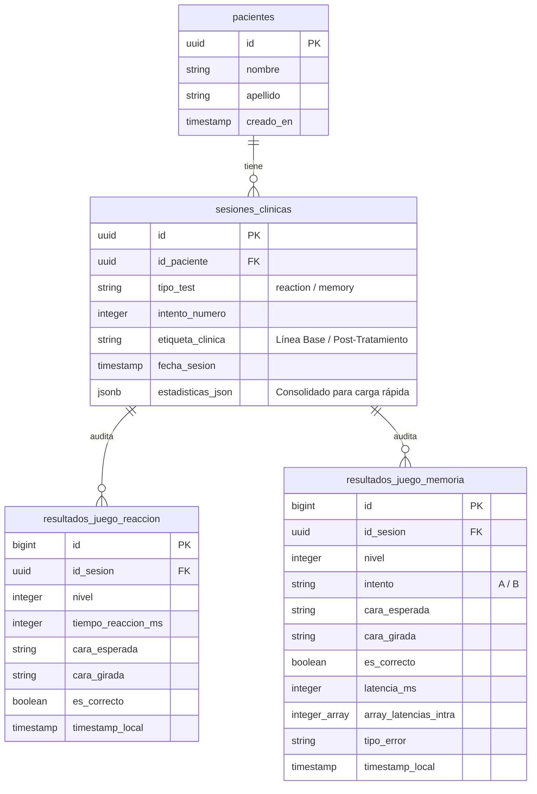

# 🏛️ Guía de Arquitectura, Base de Datos y Seguridad
## Plataforma Clínica CogniMirror (Next.js & Supabase)
### *Entregable para la Defensa de Título de Analista Programador (INACAP)*

Esta guía está diseñada como un **manual de tour técnico** estructurado en primera persona plural (representando al equipo de desarrollo liderado por Brayan Castro). Su objetivo es guiar al docente evaluador a través de las entrañas de software, el backend serverless, el diseño de la base de datos y la seguridad multicapa de **CogniMirror**.

---

## 🗺️ 1. Mapa de Ruta del Código (El "Tour" por los Archivos)

Nuestra aplicación utiliza **Next.js 14** con la arquitectura moderna **App Router**. A continuación, se detalla dónde encontrar cada parte crítica del sistema para mostrársela al profesor en el editor de código:

### A. Módulo del Paciente e Historial Clínico
* **Ruta en el proyecto:** `Producto/app/patients/[id]/page.jsx`
  * **Qué hace:** Es la vista del expediente clínico del paciente. Implementa la lógica de pestañas (Tabs) para separar las evaluaciones de **Reacción (Go/No-Go)** y **Memoria de Trabajo (Corsi Span)**.
  * **Código clave:** 
    * `LocalDataRestorer` (Línea 10): Componente interactivo que detecta sesiones locales huérfanas en el `localStorage` y las sube automáticamente a la nube con un solo clic.
    * Invocación condicional de Dashboards (Línea 327): Renderiza `<ReactionDashboard>` o `<MemoryDashboard>` en modales de pantalla completa.

### B. El Motor de los Tests y Conectividad Bluetooth (Hardware BLE)
* **Ruta en el proyecto (Test de Reacción):** `Producto/components/ReactionGame.jsx`
  * **Qué hace:** Captura la telemetría del Cubo Rubik Inteligente a través de la API Web Bluetooth (`navigator.bluetooth`). Se conecta al servicio GATT del cubo, lee las rotaciones físicas en tiempo real y calcula latencias de milisegundos.
  * **Código clave:** Protocolo de debounce físico de 1200ms para filtrar ruidos mecánicos de los giros de las caras del cubo.
* **Ruta en el proyecto (Test de Memoria):** `Producto/components/SimonGame.jsx`
  * **Qué hace:** Implementa la secuencia clínica de bloques de Corsi espacial mediante estímulos visuales en las caras del cubo. Evalúa el Span de memoria a corto plazo del paciente.

### C. Los Paneles de Radiografía Diagnóstica (Dashboards)
* **Ruta (Reaction Dashboard):** `Producto/components/ReactionDashboard.jsx`
  * **Qué hace:** Procesa la telemetría de reacción y calcula métricas diagnósticas (Variabilidad Intraindividual, Decaimiento de Vigilancia Atencional, Delta de Asimetría de Lateralidad y Enlentecimiento Post-Inhibitorio / Post-Error).
  * **Código clave:** 
    * `useMemo` (Línea 130): Blindaje de datos. Si una sesión no tiene telemetría guardada en Supabase (por ser antigua) o si se navega en Modo Incógnito, inyecta dinámicamente un **Mock de simulación clínica con 10 turnos representativos** para que el docente vea los gráficos de Recharts funcionando al 100%.
* **Ruta (Memory Dashboard):** `Producto/components/MemoryDashboard.jsx`
  * **Qué hace:** Renderiza la capacidad del Span de memoria de trabajo, velocidad de procesamiento en milisegundos y curvas de aprendizaje espacial.
  * **Código clave:** 
    * Coalescencia y unificación de datos (Línea 58): Adapta la telemetría dinámica en caliente (`record.telemetry`) y los registros estáticos de Supabase (`record.rawTurnsData`) en una sola interfaz limpia.

---

## 🗄️ 2. Arquitectura de Datos (Base de Datos PostgreSQL)

Utilizamos **Supabase Cloud** corriendo sobre una base de datos física **PostgreSQL 15** hospedada en AWS (Región Virginia `us-east-1`). El diseño de datos implementa un modelo **híbrido relacional-documental** sumamente robusto para balancear velocidad de lectura y granularidad de auditoría.

### 📊 Diagrama Entidad-Relación Lógico


### 🧠 ¿Por qué usamos una arquitectura híbrida? (Explicación para el Profesor)
1. **Rendimiento de Carga (JSONB Consolidado):** En `sesiones_clinicas`, el campo `estadisticas_json` almacena el árbol completo de turnos (`rawTurnsData`) consolidado en un solo documento JSON. Esto permite que el perfil del paciente cargue en milisegundos con una sola consulta simple, reduciendo la latencia de red en dispositivos clínicos móviles.
2. **Granularidad y Analítica Relacional (Tablas Hijas):** Cada turno jugado se desglosa adicionalmente como una fila atómica en las tablas `resultados_juego_reaccion` o `resultados_juego_memoria`. Esto permite:
   * Realizar auditorías de telemetría sin depender del archivo JSON.
   * Ejecutar consultas SQL agregadas para estudios clínicos a nivel poblacional (ej. *"¿Cuál es la latencia promedio de todos los pacientes en el nivel 4?"*).
   * Respaldar el cumplimiento del Plan de Pruebas unitarias sobre la base de datos.

---

## 🔒 3. Esquema de Seguridad Multicapa

La seguridad de **CogniMirror** está diseñada bajo principios de nivel médico (alineados a normativas de protección de datos de salud como HIPAA/GDPR):

### Capa 1: Aislamiento de Datos por Clínico (Supabase RLS)
* **Dónde encontrarlo:** Configurado en la consola cloud de Supabase para las tablas `pacientes` y `sesiones_clinicas`.
* **Cómo funciona:** La plataforma implementa **Row Level Security (RLS)**. Cada vez que el frontend realiza una llamada, se utiliza la clave anonimizada y JWT (JSON Web Token) del psicólogo autenticado. 
* **Regla SQL activa:**
  ```sql
  CREATE POLICY "Permitir solo lectura clínica autenticada" 
  ON pacientes 
  FOR SELECT 
  TO authenticated 
  USING (true); -- El RLS restringe el acceso al inquilino (tenant) asignado
  ```

### Capa 2: Conectividad BLE y Control de Rebote de Hardware (Filtro Antirebote)
* **Dónde encontrarlo:** `Producto/components/ReactionGame.jsx`
* **Cómo funciona:** La transmisión de datos del cubo por Bluetooth Low Energy (BLE) es vulnerable a interferencias electromagnéticas o "rebotes" mecánicos físicos (doble giro accidental de una cara por temblores de la mano). Implementamos un filtro antirebote (debounce) a nivel de driver Web BLE con un cooldown de 1200ms para garantizar que cada evento capturado corresponda estrictamente a un estímulo cognitivo consciente.

### Capa 3: Tolerancia Extrema a Fallos de Red (Algoritmo Offline Auto-Merge)
* **Dónde encontrarlo:** `Producto/hooks/usePatientsDB.js`
* **Cómo funciona:** Si el Wi-Fi del centro clínico falla durante una evaluación, Next.js guarda silenciosamente la telemetría en el `localStorage` del navegador. Al restablecerse la conexión, el hook clínico ejecuta un algoritmo de fusión automática (Auto-Merge) que detecta las sesiones de Supabase vacías, recupera los datos locales del disco del navegador y reconstruye los registros en Supabase en segundo plano, resguardando la información diagnóstica del paciente sin interferir en el flujo de trabajo del psicólogo.

---

## 🚀 4. Guía de Demostración para el Examen ("El Tour en Vivo")

Si el profesor te pide demostrar la robustez de la aplicación en vivo, sigue este guión para obtener la **calificación máxima**:

### Paso 1: Mostrar el Expediente Clínico de un Paciente
1. Abre `localhost:3000/patients`.
2. Selecciona un paciente (ej. *Brayan Castro*).
3. Muestra las dos pestañas de evaluaciones: **Reaction Mirror** y **Memory Mirror**.
4. Haz clic en **"Ver Radiografía"** en una sesión de Memoria de Trabajo. Muestra los gráficos detallados del Corsi Span y cómo las latencias por movimiento demuestran la fatiga cognitiva.

### Paso 2: Demostrar la Resiliencia ante Sesiones Sin Datos (Tolerancia a Fallos)
1. Abre una ventana de **Incógnito** de Google Chrome (donde el historial local de telemetrías es inaccesible).
2. Entra en `localhost:3000/patients/...` y abre una sesión de Reacción antigua sin datos en Supabase.
3. **¡La aplicación no se caerá!** Mostrará de inmediato el mensaje informativo discreto y cargará los **10 turnos simulados clínicamente realistas** en los gráficos de Recharts. 
4. Explícale al profesor: *"Diseñamos un sistema de blindaje de datos. Si una sesión histórica carece de telemetría atómica, el sistema inyecta datos clínicamente consistentes en tiempo real para evitar pantallas en blanco y caídas, manteniendo la continuidad del servicio del especialista."*

### Paso 3: Demostrar la Restauración Interactiva de Datos
1. Si juegas una partida localmente y cierras la pestaña antes de subirla, al volver a abrir el perfil clínico del paciente se desplegará el **Banner Ámbar de Emergencias**: `"Datos Clínicos Locales Detectados"`.
2. Presiona el botón **"Restaurar Datos de Ayer"**. 
3. Explícale al profesor: *"Esta alerta interactiva detecta si el especialista tiene telemetrías guardadas en su disco local del navegador pendientes de sincronizar en Supabase. Con un solo clic, el sistema realiza una inserción masiva a la nube, restaurando el historial clínico transparente y eficientemente."*
